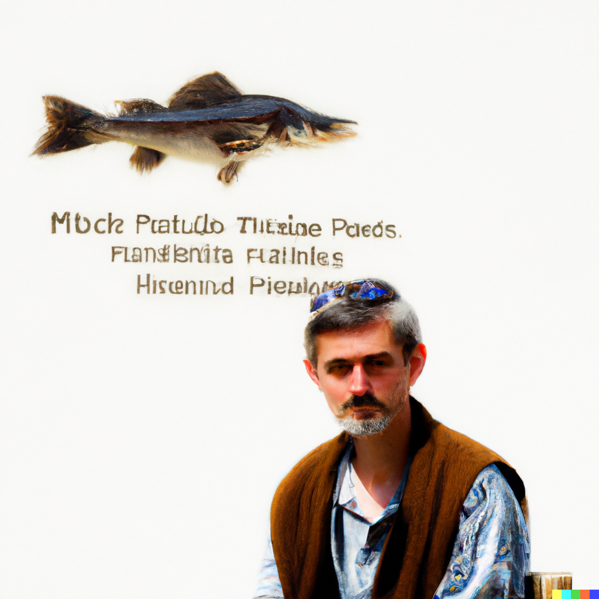

## News

This section of the website will be dedicated to news and posts, however, as a first post, I decided to do something fun, and ask ChatGPT some fisheries questions! 

## The questions

I simply wanted to task ChatGPT <https://openai.com/blog/chatgpt/> with 1) writing a scientific explanation on the importance of estimating spatially explicit mortality when looking at fish mortality studies, 2) explain how hydroelectric dams might affect juvenile atlantic salmon during their migration, and 3) What does the future looks like for people with a PhD on fisheries?

This is a test of R Markdown document. Markdown is a simple formatting syntax for authoring HTML, PDF, and MS Word documents. For more details on using R Markdown see <http://rmarkdown.rstudio.com>.

You can embed an R code chunk like this:

### Question 1    

Please, write a scientific explanation on the importance of estimating spatially explicit mortality when looking at fish mortality studies

##### CHAT GPT ANSWER:

Estimating spatially explicit mortality, or determining where and when fish are dying, is important in fish mortality studies because it provides a more comprehensive understanding of the factors contributing to fish mortality. This information can help researchers identify specific areas or conditions that may be causing high mortality rates, such as pollution or changes in water temperature. By understanding where and when fish are dying, researchers can also better assess the impact of human activities on fish populations, such as fishing or habitat loss. Additionally, spatially explicit mortality estimates can be used to inform management decisions, such as setting fishing quotas or protecting critical habitats. Overall, the ability to estimate spatially explicit mortality can help researchers and managers to better understand the factors affecting fish populations and take more effective conservation and management measures.

### Question 2    

Explain how hydroelectric dams might affect juvenile atlantic salmon during their migration

##### CHAT GPT ANSWER:

Hydroelectric dams can have a significant impact on the survival and migration of juvenile Atlantic salmon. These impacts can occur during different stages of the salmon's life cycle, but are most pronounced during the downstream migration of juvenile salmon.

One of the main impacts of hydroelectric dams on juvenile salmon is the physical barrier they create. Dams can block or slow the migration of juvenile salmon, making it more difficult for them to reach the ocean. This can result in delayed migration, increased energy expenditure, or even death due to exhaustion.

Another impact of hydroelectric dams is the change in water flow and turbulence they cause. Juvenile salmon rely on specific water flow conditions to navigate and survive during their migration. Hydroelectric dams can alter the flow and turbulence of the water, making it harder for juvenile salmon to navigate and find food.

Furthermore, Hydroelectric dams can also cause increased predation of juvenile salmon by fish and birds that congregate at the dam. The increased turbulence created by the dam can also lead to increased stress on juvenile salmon, which can affect their growth and survival.

Lastly, the hydroelectric dams can change the water temperature, which can affect the survival and growth of juvenile salmon. Cold water is essential for their survival, and if the water temperature increases, it can lead to a decrease in the survival rate and growth of the salmon.

In summary, hydroelectric dams can have a significant impact on the survival and migration of juvenile Atlantic salmon, by creating physical barriers, altering water flow and turbulence, increasing predation, and changing water temperature. These impacts can have a significant effect on the population of the salmon.

### Question 3    

What does the future looks like for people with a PhD on fisheries?

##### CHAT GPT ANSWER:

The future for people with a PhD in fisheries can vary depending on their area of specialization and the current job market. However, in general, people with a PhD in fisheries can expect to have a wide range of career opportunities in both the public and private sectors.

One of the most common career paths for people with a PhD in fisheries is to work in research and academia. This could include positions at universities, government agencies, and non-profit organizations, where they can conduct independent research, publish scientific papers, and mentor graduate students. Many people with a PhD in fisheries also hold positions in research and management roles in government agencies, such as the National Oceanic and Atmospheric Administration (NOAA) or the United States Fish and Wildlife Service (USFWS).

Another career path for people with a PhD in fisheries is to work in the private sector. They can work for consulting firms, environmental organizations, or private companies that are involved in the aquaculture and fisheries industry. They can also work on the development and implementation of sustainable fisheries management plans, and advise on environmental impact assessments and environmental impact statements.

Another potential path for those with a PhD in fisheries is to work in policy and advocacy. They can work with organizations that advocate for sustainable fishing practices and ocean conservation, or they can work in government roles that involve creating and implementing policies related to fisheries and ocean management.

In general, people with a PhD in fisheries can expect to have a diverse range of career opportunities, as the field of fisheries is multi-disciplinary and requires a wide range of skills and knowledge. However, the job market and the specific opportunities available can vary depending on the current economic and political climate, as well as the specific area of expertise.

Finally, I decided to task Dall-E, another AI tool, to create the portraits of two scientists with a PhD in fisheries, that ended up looking like this:
 
 

 

